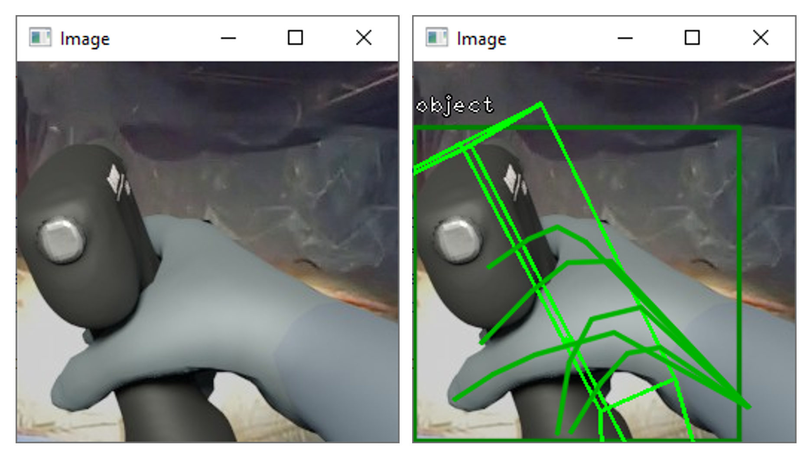

# HMD-EgoPose: head-mounted display-based egocentric marker-less tool and hand pose estimation for augmented surgical guidance
We present HMD-EgoPose: a deep learning-based framework making hand and rigid object pose estimation available to commercially available optical see-through head-mounted displays (OST-HMDs) using a low-latency streaming approach and a computing workstation.

- [Link to pre-print on arXiv](https://arxiv.org/abs/2202.11891)


This work contains code adapted from the following repositories:
- [EfficientPose by ybkscht:](https://github.com/ybkscht/EfficientPose) Tensorflow/Keras implementation with scripts for model structure, data augmentation, and evaluation
- [Yet-Another-EfficientDet-Pytorch by zylo117:](https://github.com/zylo117/Yet-Another-EfficientDet-Pytorch) PyTorch network implementation for the EfficientNet and EfficientDet backbones
- [node-dss by bengreenier:](https://github.com/bengreenier/node-dss) Simple signalling server for WebRTC

## Table of contents
- [Project setup](#project-setup)
- [Data](#data)
- [Debug](#debug)
- [Training](#training)
- [Evaluation](#evaluation)
- [Run Sample with the HoloLens 2 and a Workstation](#run-sample-with-the-hololens-2-and-a-workstation)
- [Citation](#citation)

## Project setup
Folder setup for the project sample.

```
datasets/
... real_colibri_v1/
... syn_colibri_v1/

format-labels/

pytorch-sandbox/
... efficientdet/
... efficientnet/
... efficientpose/
... eval/
... generators/
... onnx-models/
... utils/
... weights/

unity-sandbox/
... HoloLens2-Machine-Learning-WebRTC/
... node-dss/
... OpenCVDNNSandboxNetCore/
... WebRTCNetCoreSandbox/
```

## Data
Download the Synthetic and Real datasets for the Colibri II drill, unzip the folders to a specified destination, and convert data format to prepare for training [link to project site for data access](http://medicalaugmentedreality.org/handobject.html).
- [Synthetic dataset direct download link](http://medicalaugmentedreality.org/datasets/syn_colibri_v1.zip)
- [Real dataset direct download link](http://medicalaugmentedreality.org/datasets/real_colibri_v1.zip)

### Format data for training
- Navigate to the `format-labels/` directory and create a minimal virtualenv to run the extraction scripts
- Download [Python for Windows](https://www.python.org/getit/windows/) (tested with Python 3.7.9)

```bash
python -m virtualenv -p 3.7 venv
.\venv\Scripts\activate

# Install requirements
pip install -r requirements.txt
```

- After unzipping the downloaded datasets, begin formatting the Synthetic and Real datasets with the following commands (this can take a while)

```bash
# Prepare synthetic dataset
python .\pkl_to_formatted_txt.py --dataset syn_colibri --in_dir "C:/Users/Mitch/Downloads/" --out_dir "C:/git/public/hmd-ego-pose/datasets/"

# Prepare real dataset
python .\pkl_to_formatted_txt.py --dataset real_colibri --in_dir "C:/Users/Mitch/Downloads/" --out_dir "C:/git/public/hmd-ego-pose/datasets/"
```

After successful completion of these commands, you should have the following output and directory structure for both the `syn_colibri_v1` and `real_colibri_v1` folders. 


The `.yml` file should contain rotation and translation matrices for the camera to model, the object bounding box and class, and the drill tip transform as the below sample.

```yml
0: 
- cam_R_m2c: [0.7887479987958447, -0.6285408366572683, 0.03812666487227634, -0.601701596829051, -0.8060479489556668, 0.16356679108674974, -0.07601779699325562, 0.09633129835128784, -0.9960060119628906]
  cam_t_m2c: [-29.27876390254138, -52.119556134360224, 494.5744672954083]
  obj_bb: [210, 271, 6, -33]
  obj_id: 1
  drill_tip_transform: [101.554, 338.261, -326.146, 1]
```

## Debug
- We include an optional sample script `debug.py` to view the ground truth data projected onto input RGB image data and confirm correct data formatting
- To check the formatting and correctness of training data, run the following sample commands

```bash
# View the synthetic dataset fold 0
python .\debug.py --dataset syn_colibri --fold 0 

# View the real dataset fold 0
python .\debug.py --dataset real_colibri --fold 0 
```

- The images will show as below:



## Training
Includes the resources for data formatting, loading, training, and export of a custom machine learning framework for rigid surgical drill pose estimation

### Run sample
- Ensure that the correct [CUDA](https://developer.nvidia.com/cuda-toolkit-archive) and [cuDNN](https://developer.nvidia.com/rdp/cudnn-archive) library versions are installed to support [PyTorch 1.8.2 LTS](https://pytorch.org/) (tested with CUDA 11.1)
- Download [Python for Windows](https://www.python.org/getit/windows/) (tested with Python 3.7.9)
- In the `pytorch-sandbox/` directory, create the virtual environment setup for training as below

```bash
python -m virtualenv -p 3.7 venv
.\venv\Scripts\activate

# For training on NVIDIA 3000 series GPUs (CUDA 11.1 support)
pip install torch==1.8.2+cu111 torchvision==0.9.2+cu111 torchaudio===0.8.2 -f https://download.pytorch.org/whl/lts/1.8/torch_lts.html

# Install requirements
pip install -r requirements.txt

# Compile the cython modules
python setup.py build_ext --inplace
```

### Begin training
- From the `pytorch-sandbox/` directory, we can begin training HMD-EgoPose using the `EfficientNet-B0` backbone
- To monitor training/validation accuracy/loss, a TensorBoard training log is output to the `runs/` folder
- At the end of each epoch, the model weights with the lowest transformation error will be saved to the `train_weights` folder
- After completing training on the dataset, the model weights which achieved the highest accuracy on the validation set are selected for evaluation on the test set

```bash
# Begin training on fold 0 of synthetic colibri dataset
python main.py --dataset='syn_colibri' --iter=0 --img_size='256,256' --batch_size=16 --fold=0
```

### Continue training with existing weights
- After training on the synthetic colibri dataset, the best performing training weights can be used for fine-tuning performance on the smaller real colibri dataset

```bash
# Fine tune model using best performing weights from the synthetic colibri dataset training on fold 0 of the real colibri dataset
python main.py --dataset='real_colibri' --iter=0 --img_size='256,256' --batch_size=16 --fold=0 --ckpt=train_weights/syn_colibri__fold_3__iter_0__mixed_t_mean_10.29__epo_49.pth --fine_tune=True
```

## Evaluation
- To evaluate the model with the best performing weights for that specific dataset (real or synthetic colibri) use:

``` python
# Best performing weights on real colibri dataset
python evaluate.py --dataset='real_colibri' --iter=0 --img_size='256,256' --batch_size=1 --fold=4 --n_workers=6 --weights='train_weights/real_colibri__fold_2__iter_0__mixed_t_mean_13.19__epo_44.pth'
```

```bash
# Best performing weights on synthetic colibri dataset
python evaluate.py --dataset='syn_colibri' --iter=0 --img_size='256,256' --batch_size=1 --fold=4 --n_workers=6 --weights='train_weights/syn_colibri__fold_3__iter_0__mixed_t_mean_10.29__epo_49.pth'
```

- After running, the relevant results will be printed to the terminal window as in the below sample for the real dataset


- For each fold the following metrics are presented:
  - Tool ADD (in mm) is given by 
  `TranslationErrorMean_in_mm` with standard deviation `TranslationErrorStd_in_mm`
  - Drill tip error (in mm) is given by `TranslationErrorTipMean_in_mm` with standard deviation `TranslationErrorTipStd_in_mm`
  - Drill bit direction error (in deg) is given by `RotationErrorMean_in_degree` with standard deviation `RotationErrorStd_in_degree`
  - Hand ADD (in mm) is given by `TranslationErrorHandMean_in_mm` with standard deviation `TranslationErrorHandStd_in_mm`

## Run sample with the HoloLens 2 and a workstation
### About
- Tested with Unity 2019.4 LTS, Visual Studio 2019, and the HoloLens 2 with build 19041.1161 (Windows Holographic, version 20H2 - August 2021 Update) though will likely work fine with newer versions
  - The 10.0.19041.1161 HoloLens 2 build can be downloaded from the following [link](https://aka.ms/hololens2download/10.0.19041.1161) and installed using the [Advanced Recovery Companion](https://www.microsoft.com/en-ca/p/advanced-recovery-companion/9p74z35sfrs8?rtc=1&activetab=pivot:overviewtab)
- Input video frames of size `(1, 3, 512, 512)` for online inference `(NCWH)`
- Pretrained PyTorch weights of the HMD-EgoPose framework were formatted and exported to an ONNX model format for use

To run the sample on the HoloLens 2, there are four required components: 
1. `HoloLens2-Machine-Learning-WebRTC`: the Unity project which can be deployed on the computing workstation (desktop) or HoloLens 2
2. `WebRTCNetCoreSandbox`: the WebRTC C# project for receiving video frames and performing network inference on the computing workstation (desktop)
3. `OpenCVDNNSandboxNetCore`: a sample C# project used for optional model validation against the Python implementation
4. `node-dss`: the signaling server for WebRTC based communication

### Node dss
We use [node-dss](https://github.com/bengreenier/node-dss) as a simple signaling server for WebRTC and streaming our video/pose predictions from the HoloLens 2 to the computing workstation.
To install, follow the directions below:
- Install [nodejs](https://nodejs.org) to leverage this service
- Install dependencies with [npm](http://npmjs.com/) - from the `unity-sandbox/node-dss` open a [Git Bash](https://git-scm.com/downloads) window and run:
```
npm install
export DEBUG=dss*
set DEBUG=dss*
npm start
```

- You should see the Git Bash window output as below:


### Run sample on a single desktop
- Open `HoloLens2-Machine-Learning-WebRTC` project in Unity, load the `WebcamVideoLocal` scene
- Navigate to the `NodeDssSignaler` component in the Unity window and adjust the `HttpServerAddress` to the IP of your current machine
  - For example, `http://xxx.xxx.x.xx:3000/`, while keeping the port as 3000
  - Leave the `LocalPeerId` and `RemotePeerId` values as is


- On playing the Unity scene, you should be able to see video from a webcam connected to the PC (on the `LocalMedia`→`VideoPlayer` component) and you should see that your program has begun polling in the node dss window as:

```
2022-06-17T14:33:28.852Z dss:boot online @ 3000
2022-06-17T14:44:32.776Z dss GET /data/HoloLens2MachineLearningWebRTC 404 - - 1.051 ms
2022-06-17T14:44:33.265Z dss GET /data/HoloLens2MachineLearningWebRTC 404 - - 0.073 ms
2022-06-17T14:44:33.768Z dss GET /data/HoloLens2MachineLearningWebRTC 404 - - 0.085 ms
2022-06-17T14:44:34.270Z dss GET /data/HoloLens2MachineLearningWebRTC 404 - - 0.066 ms
2022-06-17T14:44:34.773Z dss GET /data/HoloLens2MachineLearningWebRTC 404 - - 0.065 ms
```

- Now, open the `WebRTCNetCoreSandbox` project in Visual studio
- In the `Program.cs` file, make the following adjustments based on your own setup
  1. Update the file path to the location of the `onnx-models/` folder
  ```c#
  // Update the file path to point to the location of the onnx-models/ folder
  const string basePath = "C:/git/public/hmd-ego-pose/pytorch-sandbox/onnx-models/";
  ```
  2. Change the `HttpServerAddress` to the IP of your PC
  ```c#
  // Initialize the signaler
  signaler = new NodeDssSignaler()
  {
    // Set to your IP (same as in the Unity project), leave the 
    // LocalPeerId and RemotePeerId values
      HttpServerAddress = "http://192.168.2.29:3000/",
      LocalPeerId = "WebRTCSandbox",
      RemotePeerId = "HoloLens2MachineLearningWebRTC",
  };
  ```
- **After ensuring the Unity project is already running**, set the project to `Release` and `x64` and run the sample
- As indicated in the below image, you can either create a 3D printed drill to test the network, OR aim your webcam at your computer monitor and view images/video from the surgical drill dataset
- In the image, the left window is the Unity window running the `HoloLens2-Machine-Learning-WebRTC` Unity project; the right window is the `WebRTCNetCoreSandbox` project; and the bottom right window is the Git Bash window running `node-dss`
- The predicted pose for the surgical drill identified in the webcam video is applied to the virtual drill model in the Unity scene (in red)


### Run sample on the HoloLens 2 and companion desktop
- Open `HoloLens2-Machine-Learning-WebRTC` project in Unity and load to the `HoloLensVideoLocal` scene
- Navigate to the `NodeDssSignaler` component in the Unity window and adjust the `HttpServerAddress` to the IP of your current machine (desktop not the HoloLens 2)
  - For example, `http://xxx.xxx.x.xx:3000/`, while keeping the port as 3000
  - Leave the `LocalPeerId` and `RemotePeerId` values as is
- Switch build platform to `Universal Windows Platform`, select `HoloLens` for target device, and `ARM` as the target platform
- Build the Visual Studio project and deploy to the HoloLens 2
- On opening the app on the HoloLens 2, you should be able to see that your program has begun polling in the node dss window as:

```
2022-06-17T15:22:56.034Z dss:boot online @ 3000
2022-06-17T15:22:56.424Z dss GET /data/HoloLens2MachineLearningWebRTC 404 - - 0.908 ms
2022-06-17T15:22:56.520Z dss GET /data/HoloLens2MachineLearningWebRTC 404 - - 0.074 ms
2022-06-17T15:22:57.044Z dss GET /data/HoloLens2MachineLearningWebRTC 404 - - 0.075 ms
2022-06-17T15:22:57.617Z dss GET /data/HoloLens2MachineLearningWebRTC 404 - - 0.070 ms
2022-06-17T15:22:58.188Z dss GET /data/HoloLens2MachineLearningWebRTC 404 - - 0.062 ms
```

- Now, open the `WebRTCNetCoreSandbox` project in Visual studio
- In the `Program.cs` file, make the following adjustments based on your own setup
  1. Update the file path to the location of the `onnx-models/` folder
  ```c#
  // Update the file path to point to the location of the onnx-models/ folder
  const string basePath = "C:/git/public/hmd-ego-pose/pytorch-sandbox/onnx-models/";
  ```
  2. Change the `HttpServerAddress` to the IP of your PC
  ```c#
  // Initialize the signaler
  signaler = new NodeDssSignaler()
  {
    // Set to your IP (same as in the Unity project), leave the 
    // LocalPeerId and RemotePeerId values
      HttpServerAddress = "http://192.168.2.29:3000/",
      LocalPeerId = "WebRTCSandbox",
      RemotePeerId = "HoloLens2MachineLearningWebRTC",
  };
  ```
- **After ensuring the HoloLens 2 application is already running**, set the project to `Release` and `x64` and run the sample
- As indicated in the below image, you can either create a 3D printed drill to test the network, OR aim your webcam at your computer monitor and view images/video from the surgical drill dataset
- In the image, the virtual surgical drill model is visible in red, with the `WebRTCNetCoreSandbox` project; and the bottom right window is the Git Bash window running `node-dss` inb the background
- The predicted pose for the surgical drill identified in the HoloLens 2 front facing camera video is applied to the virtual drill model in the Unity scene (in red)
  - Though the drill pose was not perfect in this sample, there was some additional error introduced through the mixed reality capture API and the lack of camera extrinsic parameter streaming with WebRTC and the HoloLens


### *Optional*: Comparing C# ONNX results to PyTorch and ONNX results in Python
Test data is included in the `onnx-models` folder. 
- The `scratchpad.py` script demonstrates loading of data and the ONNX model with basic inference in Python (no additional output filtering)
- Filtering and regression of network outputs is demonstrated in `evaluate.py` to arrive at a rotation and translation prediction for the rigid object
- The output of `scratchpad.py` and `evaluate.py` can be used to compare to the `OpenCVDNNSandboxNetCore` C# implementation to assess accuracy of predictions
- Running `evaluate.py` with sample input image `000000.png`, we arrive at the following prediction result

```C#
// Desired final results of prediction (from evaluate.py script with input 000000.png)
camera_matrix:
 [[480.   0. 128.]
 [  0. 480. 128.]
 [  0.   0.   1.]]
rotation_gt: [[-2.92229713  1.00365327  0.09353241]]
translation_gt: [[-0.02927876 -0.05211956  0.49457447]]
rotation_pred: [[-2.9054394  1.0276762  0.1723399]]
translation_pred: [[-0.02811211 -0.05858146  0.48664188]]
```

- Running the C# `OpenCVDNNSandboxNetCore` project with sample input image `000000.png`, we arrive at the following pre-processed input frame:
  - *Note:* You will need to adapt the paths in this project to be relevant to your local path structure


- And output to the terminal window, we can observe that the C# produced results are nearly identical to the Python produced results:


### *Optional:* Build ONNX Runtime from source
- Build TensorRT from source for processing
- Download Nuget command line (https://www.nuget.org/downloads) and add to environment variables
- Resources from ONNX runtime on how to build the package [link 1](https://www.onnxruntime.ai/docs/how-to/build.html) and [link 2](https://www.onnxruntime.ai/docs/how-to/build/inferencing.html)
- `xxx\Release\Release\nuget-artifacts`
- Requirements
  - Cuda 11.0
  - cuDNN v8.0.5
  - TensorRT 7.2.3.4
- Below are the commands used for building the ONNX runtime library from source on my hardware, successful completion of these builds will result in a NuGet package (like those in the `unity-sandbox/` directory)
 
```powershell
# CPU 
# Debug
# Release
.\build.bat --config Release --build_shared_lib --parallel --cmake_generator "Visual Studio 16 2019" --build_nuget --build_dir cpu --skip_tests

# CUDA
# Using Cuda 11.0, cuDNN v8.0.5
# Debug
# Release
.\build.bat --config Release --build_shared_lib --parallel --cmake_generator "Visual Studio 16 2019" --build_nuget --skip_tests --use_cuda --cuda_home "C:\Program Files\NVIDIA GPU Computing Toolkit\CUDA\v11.0" --cudnn_home "C:\Program Files\NVIDIA GPU Computing Toolkit\CUDA\v11.0" --cuda_version 11.0 --build_dir cuda 

# TensorRT
# Using Cuda 11.0, cuDNN v8.0.5, TensorRT 7.2.3.4
# Debug
# Release
.\build.bat --config Release --build_shared_lib --parallel --cmake_generator "Visual Studio 16 2019" --build_nuget --skip_tests --use_cuda --cuda_home "C:\Program Files\NVIDIA GPU Computing Toolkit\CUDA\v11.0" --cudnn_home "C:\Program Files\NVIDIA GPU Computing Toolkit\CUDA\v11.0" --use_tensorrt --tensorrt_home "C:\Program Files\NVIDIA GPU Computing Toolkit\CUDA\v11.0\TensorRT-7.2.3.4" --cuda_version 11.0 --build_dir tensorrt 

# DirectML
# Debug
# Release
.\build.bat --config Release --build_shared_lib --parallel --cmake_generator "Visual Studio 16 2019" --build_nuget --use_dml --build_dir directml --skip_tests
```

## Citation
If you found this code repo useful, please consider citing the associated publication:
```
@article{doughty2022hmd,
  title = {{HMD}-{EgoPose}: head-mounted display-based egocentric marker-less tool and hand pose estimation for augmented surgical guidance},
  issn = {1861-6429},
  url = {https://doi.org/10.1007/s11548-022-02688-y},
  doi = {10.1007/s11548-022-02688-y},
  journaltitle = {International Journal of Computer Assisted Radiology and Surgery},
  author = {Doughty, Mitchell and Ghugre, Nilesh R.},
  date = {2022-06-14},
}
```
